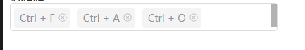
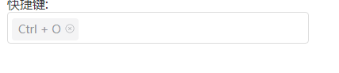

## 快捷键输入框(hotkeyInput-vue3)

### 简单使用

#### 多个

```vue
<template>
	<HotkeyInput :max="5" :multiple="true"  v-model="shortcutStr" ></HotkeyInput>
</template>

<script lang='ts'>
    import HotkeyInput from '@/renderer/views/components/hotkeyInput-vue3/index.vue';
    export default defineComponent({
        components:{
            HotkeyInput
        },
        setup() {
           	//在 :multiple="true" 下面两个定义都是正确的,如果未设置 :multiple="true" 则无效
            //let shortcutStr = ref(new Set(['Ctrl + F','Ctrl + A','Ctrl + o']));
            let shortcutStr = ref(['Ctrl + F', 'Ctrl + A', 'Ctrl + O']);
        }
    })
</script>

```

##### 效果



#### 单个

```vue
<template>
	<HotkeyInput  v-model="shortcutStr" ></HotkeyInput>
</template>

<script lang='ts'>
    import HotkeyInput from '@/renderer/views/components/hotkeyInput-vue3/index.vue';
    export default defineComponent({
        components:{
            HotkeyInput
        },
        setup() {
            let shortcutStr = ref('Ctrl + O');
        }
    })
</script>
```

##### 效果



### HotkeyInput  Attributes

| 参数                 | 说明                                                   | 类型                 | 可选值 | 默认值       |
| -------------------- | ------------------------------------------------------ | -------------------- | ------ | ------------ |
| v-model / modelValue | 绑定值(只有在multiple为true时传入的 Array / Set才有效) | string / Array / Set | —      | —            |
| multiple             | 是否为多个                                             | Boolean              | —      | false        |
| max                  | 最多限制多少个(只有在multiple为true时有效)             | Number               | —      | 3            |
| placeholder          | 提示文字                                               | String               | —      | 请设置快捷键 |


### HotkeyInput  Events

| 事件名称 | 说明                     | 回调参数   |
| -------- | ------------------------ | ---------- |
| change   | 当绑定值变化时触发的事件 | 更新后的值 |

